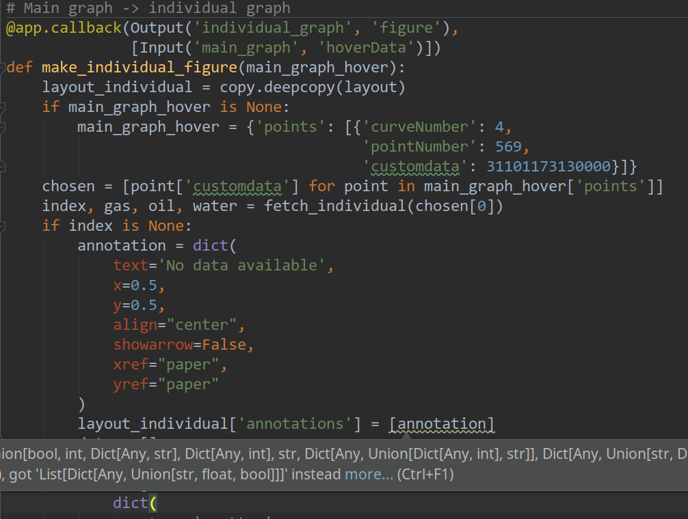

## Thinking in Dictionaries 
## {  }

---

### Aaron Harris

### aaron@kite.com

#### Dev Advocate + Consultant
(Python, JavaScript, Automation)


(Bartending, Jury Duty ...)

Note:

- Offers a wide-range of enhanced presentation **tools** and **features**
- Both on the desktop and in the cloud
- Learn more on the GitPitch website at https://gitpitch.com

---

##### This Presentation (now): 
##### https://gitpitch.com/alphaharris/thinking-in-dictionaries

------

#### Based on a True Blog Post: 
#### https://kite.com/blog/python/python-dictionaries

---

#### Quick poll... 

---

#### Solved a problem with a dictionary this week


---

#### Solved a problem with a dictionary this week

@ul[spaced text-white]
- Performance
- Interface
    - now[we][can][do][this]
- Better Code
@ulend


---

#### Who needed to 
####  look up dictionaries this week? 

--- 
### Today...
@ul[spaced text-white]
- Defining and Iterating
- Nested Data
- Handling JSON
- Comprehensions and Enhancements
- Working with Pandas (if we have time)
@ulend


---

### Defining and Iterating

Note: 

- Dictionaries are a powerful structure
- Best way to learn is to get some practice!
---
### TEST

---

```python
        
        my_dict = {
            'one': 1,
            'two': 2,
            'three': 3,
            }
        
        for k, v in my_dict:
            print('key: ', k)
            print('value: ',  v)

        # how do we look?

```
@[2-6](Basic dictionary definition)
@[8-10](Yes, there is a problem here...)
@[12](What's the error?)


---

#### ValueError: too many values to unpack (expected 2)

---

```python

        my_dict = {
            'one': 1,
            'two': 2,
            'three': 3,
            }

        # .items() .keys() .values()
        for k, v in my_dict.items():  
            print('key: ', k)
            print('value: ',  v)

        # .keys() is nice for readability

```

---

### Kinds of Data (Nested, Relational)

---

### Relational - 


---

@ul[spaced text-white]
- Well Explored
- Know your schema going in (hopefully)
- More overhead
@ulend

---


---

### Nested - Don't Die Alone!


@ul[spaced text-white]
- Flexible, great for handling *unknowns*
- Two-edged-sword!!
- Deep structures will slow you down
- Readabililty is "key"    ¯\\_(ツ)_/¯

@ulend

---

##### The farther down you go...
##### The faster time passes in the outside world


#### Full of regret
#### Waiting to die alone

---


@ul[spaced text-white]
- Gets complicated quickly
- Might need recursion... and that's okay
- Don't be afraid to "curate"
  - one-off cherry-picking ... or ...
  - comprehensions to get specific values
- Other tools don't understand your tree
  - databases
  - apis (e.g. google sheets)
@ulend

---


### Consuming JSON

---

### Typical use-case with Requests

---

```python
import requests

r = requests.get('some_dat_site')
r.json # what's the difference here
r.text

my_data = r.json
type(my_data)
# dict()

# Okay, we have a dict! Now what?

```

---

```python

        # We want to do something with that data

        # send specific values to airtable

        # get summary statistics from Pandas

```

---

### Time Out for Readability

---

### The worst case - Dash + Mapbox

---



---

---

---
### Comps and Enhancements

---

```python

# list comps are easy to recognize
new_list = [x.name for x in my_list]

# How cool are dictionary comps??
dict_from_list = { x.name : x for x in my_list}

```

---


### defaultdict

#### Why do we need this?


### OrderedDict

#### Yes things are ordered now

#### But most code in the wild won't be

#### Better to be explicit with OrderedDict

#### Lots of examples, like BeautifulSoup, lxml, etc.

---


## Add Some Slide Candy

---?color=linear-gradient(180deg, white 75%, black 25%)
@title[Customize Slide Layout]

---

@snap[west span-50]
## Customize the Layout
@snapend

@snap[east span-50]

@snapend

@snap[south span-100 text-white]
Snap Layouts let you create custom slide designs directly within your markdown.
@snapend

---?color=linear-gradient(90deg, #E27924 65%, white 35%)
@title[Add A Little Imagination]

@snap[north-west h4-white]
#### And start presenting...
@snapend

@snap[west span-55]
@ul[spaced text-white]
- You will be amazed
- What you can achieve
- *With a little imagination...*
- And **GitPitch Markdown**
@ulend
@snapend

@snap[east span-45]
@img[shadow](assets/img/conference.png)
@snapend

---?image=assets/img/presenter.jpg

@snap[north span-100 h2-white]
## Now It's Your Turn
@snapend

@snap[south span-100 text-06]
[Click here to jump straight into the interactive feature guides in the GitPitch Docs @fa[external-link]](https://gitpitch.com/docs/getting-started/tutorial/)
@snapend
